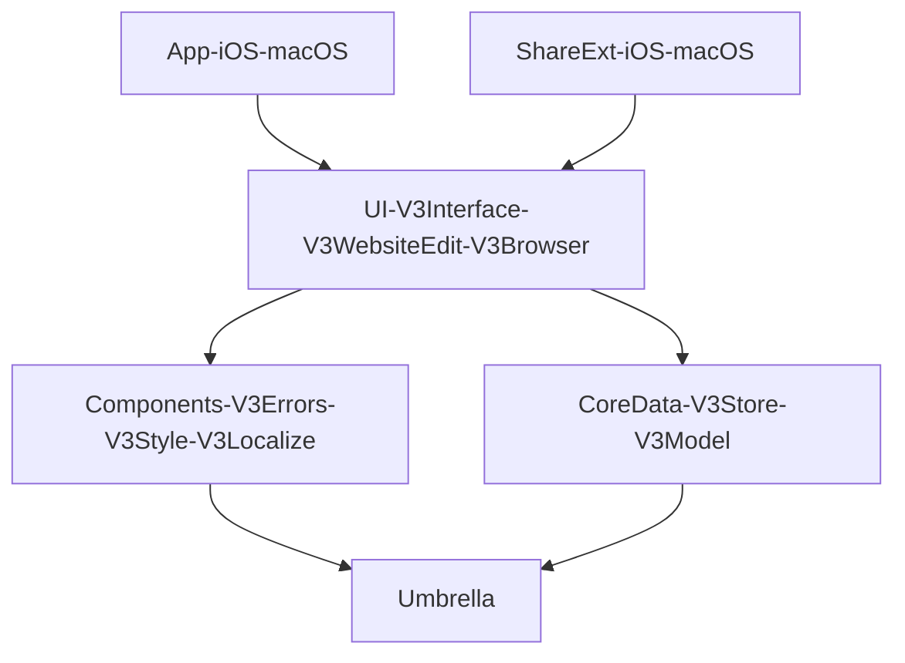

       

# Hipstapaper - iOS and Mac Reading List App

A macOS, iOS, and iPadOS app written 100% in SwiftUI. Hipstapaper is an app that takes a URL shared from another app via the share extension, loads the page to get the title, and a screenshot, and then saves the resulting bookmark via Core Data. Hipstapaper uses iCloud Core Data syncing via `NSPersistentCloudKitContainer` to sync all data between devices. Hipstapaper supports basic tagging and archiving for saved bookmarks.

## How to Get the App

Hipstapaper is tech demo and learning experience, not a fully complete application experience. If you would like to try the app, please use the links below.
- iOS:
    - [Testflight Link](https://testflight.apple.com/join/V1f2j5Jd)
- macOS:
    - [Download Notarized Build](http://www.jeffburg.com/zzNotPortfolio/Hipstapaper/current/Hipstapaper.zip)

## Summary of Capabilities

- Basic CRUD management of websites
- Tagging, Filtering, Sorting
- Bulk editing
- State restoration
- iPadOS and macOS Menus
- iPadOS and macOS "Scenes" for multiple window support
- Share extension for adding content
- iCloud Sync

## Why Did I Write This?

Hipstapaper is my tech demo application that I use to experiment with the newest Apple technologies. This latest version tries to accomplish the following:

- Separation of concerns with heavy use of Swift Package Manager
- Light wrapper around Core Data without performance hit.
    - No NSManagedObjects or any Core Data classes are public outside of the `Store` package.
    - Lists of 3000+ items load and scroll in iOS at 120Hz without issue.
- 100% Cross-platform SwiftUI
    - No Catalyst
    - No use of `UIViewRepresentable` or `NSViewRepresentable`
        - Only exception is for `WKWebView` 
    - Avoid platform specific code.
    - Avoid hacks because SwiftUI is broken.
- Support latest SwiftUI & OS Features
    - Navigation
    - Menus
    - Customizable Toolbars
    - Scenes
    - more
    
## Architecture Aspirations

My hope is not to create a new architecture paradigm like the wonderful [Bodega](https://github.com/mergesort/Bodega) project. Rather, I wanted to show how leveraging built-in technologies could lead to a UI driven 100% by SwiftUI's strict rendering of data and state.

### Package Dependencies

A simplified diagram of how the packages are associated with eachother. The goal was to have almost no code in the iOS App, macOS App, or the 2 extensions targets. Rather, they only instantiate the public `View` or `Scene` struct from their imported Package. Also each target only imports a single Swift Package. The rest of the package relationships are handled with Swift Package Manager and the associated `Package.swift` files.

### Error Handling

Error handling on iOS has always been hard. In the old days, it was possible to perform a user function and if it had an error, show that error to the user. However, in the current world where syncing and other activities are happening in the background, this 1-1 approach is no longer feasible. Rather, any part of the app needs to be able to present errors without any user interaction. AppKit on macOS has always made error handling [very easy with convenient methods](https://developer.apple.com/library/archive/documentation/Cocoa/Conceptual/ErrorHandlingCocoa/ErrorRespondRecover/ErrorRespondRecover.html) to pass errors down the responder chain and to present raw NSError objects in a user readable way. Unfortunately SwiftUI, like UIKit, doesn't help with any of this.

#### Error Responder Chain

In SwiftUI I use the environment to create an Error responder chain by declaring [`EnvironmentResponderError` in the Umbrella package](https://github.com/jeffreybergier/Umbrella/blob/db24e09eae8df537d928e5f570c203ec9fc8076a/Sources/Umbrella/Environment/EnvironmentResponder.swift#L42-L53). Using this technique allows me to "catch" errors at any level of the user interface as well as to the "throw" errors from any place in the user interface.

- [`ErrorCatcher`](Hipstapaper/Packages/V3Errors/Sources/V3Errors/Handling/ErrorCatcher.swift) Responsible for catching errors from the Environment and storing them in some form of storage that is also in the environment. This could be an EnvironmentObject or App/SceneStorage. Only 1 instance of this is needed at the very root of the application UI.
- [`ErrorMover`](Hipstapaper/Packages/V3Errors/Sources/V3Errors/Handling/ErrorMover.swift) Responsible for taking errors from the environment storage, checking whether now is an appropriate time to present an error, and then taking the error out of storage and putting it into a modal presentation property.
- [`ErrorPresenter`](Hipstapaper/Packages/V3Errors/Sources/V3Errors/Handling/ErrorPresenter.swift) Responsible for taking the error out of the modal presentation property, converting it to a `UserFacingError` and then presenting it via `.alert`

#### UserFacingError

Another concept which was easy in AppKit and difficult in UIKit/SwiftUI is presenting errors to users. `UserFacingError` is a protocol I defined which allows an error type from your data layer or other parts of the application to be easily localized and presented to the user. In this application, `V3Localize` makes the string keys public and `V3Errors` has the responsibility to conform the various error types within your application to the `UserFacingError` protocol.

#### CodableError

[`CodableError`](https://github.com/jeffreybergier/Umbrella/blob/db24e09eae8df537d928e5f570c203ec9fc8076a/Sources/Umbrella/Error/CodableError.swift#L36) is a type which attempts to take errors and store them in such a way to make them `Codable`. This is important for state restoration of the application. I'll cover this more below in the Navigation section, but all of the navigation state for the application is stored in `SceneStorage` in order to support state restoration. This makes this complex with Error as its not really possible to encode it. There is a related protocol called `CodableErrorConvertible` that allows a package to decide how it wants its errors encoded and decoded.

### Menus Handling

Handling actions via menus and keyboard shortcuts in macOS has always had the same fundamental problem, there is essentially always 3 ways to do the same action. 1. Main Menu, 2. Toolbar Button, 3. Context Menu. Now with iPad apps, the same issue arises. Luckily macOS had an easy way to deal with this issue, the responder chain. The responder chain validated Main Menu Items, Toolbar Items, and Context Menu items via easy to use methods based on selectors. iOS never gave this to us. Same with SwiftUI. SwiftUI poses similar problems to UIKit with no obvious solution. Details below.

In iOS 16 / macOS 13, Apple made a massive improvement to SwiftUI context menus for tables by adding `contextMenu(forSelectionType:menu:primaryAction:)`. At first this appears to provide just context menus, but the primary action piece is also incredibly important because it allows you to support both single tap and double click on both platforms. This was previously very difficult. That said, these are not perfect. Because the selection is passed to your code via a function, it works fundamentally different from toolbars that live in the environment. So with a toolbar, I can place a `@FetchRequest` property and then update the state of the toolbar buttons and perform actions on the CoreData object directly. But in Context Menus, this approach does not work.

A similar, but worse, issue arrises with Main Menu items. In my opinion, the "Main Menu" that is specified as part of the scene is still fundamentally broken. These menus do not live inside the environment at all. Its not even possible to read simple state from the environment. Attempting to do so will print errors in the Console and always return the default value. So while it is quite common on macOS to enable and disable menu items based on the current state of the selection in the front-most window, this is almost impossible to do with SwiftUI menus. 

I worked around these issues by creating a `BulkActionsHelper` type. But in my opinion, its a pretty big hack. So while it does work, I don't think it should have been needed. This helper basically stores an extra copy of the selection for the Main Menus. It also provides raw function hooks to the data source for the context menu.

But the core issue still remains from UIKit. The user now has 3 ways to do any given action... but because of slight differences in the environments these functions live in, the software developer is left struggling to make these 3 ways can call the same code.

### Core Data Strategy

### Styling Strategy

### Navigation Strategy

## Known Issues

- Toolbars in Sheets and Popovers on macOS are ugly.
    - This is because SwiftUI still does not render toolbars in sheets and popovers like iOS does.
- Window size is forgotten when closing windows on macOS.
    - Quitting the app does not cause them to forget their size, but closing them does.
- Using the share extension when the main application is open usually cause Core Data to return errors when editing data in the share extesnsion.

## Contribution Guidelines

I am happy to accept contributions. Please note that I always intend to be build safe and inclusive communities. I have a 0 tolerance policy towards harassment, meanness, sarcastic-ness toward any other member. Read the [code of conduct](CODE_OF_CONDUCT.md) for full details.

Please refer to an existing issue or create a new issue before beginning to work on a contribution.

## How to Clone and Run

### Requirements

- Xcode 14.2 or higher

### Instructions

This project runs entirely in Xcode with any external dependencies handled by Swift Package Manager. Note that there may be issues running on physical devices because this project relies on iCloud entitlements.

1. Clone the Repo
1. Open in Xcode
1. Build and Run
