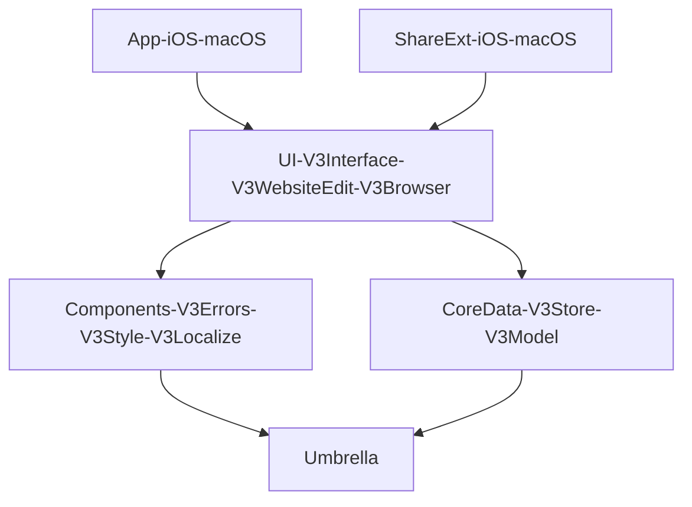

       

# Hipstapaper - iOS and Mac Reading List App

A macOS, iOS, and iPadOS app written 100% in SwiftUI. Hipstapaper is an app that takes a URL shared from another app via the share extension, loads the page to get the title, and a screenshot, and then saves the resulting bookmark via Core Data. Hipstapaper uses iCloud Core Data syncing via `NSPersistentCloudKitContainer` to sync all data between devices. Hipstapaper supports basic tagging and archiving for saved bookmarks.

## How to Get the App

Hipstapaper is tech demo and learning experience, not a fully complete application experience. If you would like to try the app, please use the links below.
- [iOS Testflight Link](https://testflight.apple.com/join/V1f2j5Jd)
- [macOS Notarized Build](/Releases/macOS/current.zip)

## Summary of Capabilities

- Basic CRUD management of websites
- Tagging, Filtering, Sorting
- Bulk editing
- State restoration
- iPadOS and macOS Menus
- iPadOS and macOS "Scenes" for multiple window support
- Share extension for adding content
- iCloud Sync

## Why Did I Write This?

Hipstapaper is my tech demo application that I use to experiment with the newest Apple technologies. This latest version tries to accomplish the following:

- Separation of concerns with heavy use of Swift Package Manager
- Light wrapper around Core Data without performance hit.
    - No NSManagedObjects or any Core Data classes are public outside of the `Store` package.
    - Lists of 3000+ items load and scroll in iOS at 120Hz without issue.
- 100% Cross-platform SwiftUI
    - No Catalyst
    - No use of `UIViewRepresentable` or `NSViewRepresentable`
        - Only exception is for `WKWebView` 
    - Avoid platform specific code.
    - Avoid hacks because SwiftUI is broken.
- Support latest SwiftUI & OS Features
    - Navigation
    - Menus
    - Customizable Toolbars
    - Scenes
    - more
    
## How I Built Hipstapaper

#### TL;DR

My hope is not to create a new architecture paradigm like the wonderful [Bodega](https://github.com/mergesort/Bodega) project. Rather, I wanted to show how leveraging built-in technologies could lead to a UI driven 100% by SwiftUI's strict rendering of data and state. The most important things I learned were:

1. Embrace SceneStorage as the source of truth for all of your navigation state to make state restoration completely automatic.
    1. This can be hard as it requires you to think through all possible navigation in your app and make it easily encodable.
1. Embrace Core Data (or your data store of choice) as the single source of truth for all data in your application.
    1. Avoiding view models is difficult but important. View Models tend to be custom classes that don't live in the environment and cannot be encoded for state restoration. This violates the first learning.
1. Embrace Property Wrappers to hide implementation details from your UI code.
1. Acknowledge that any data, navigation state, or errors could change at any time and build abstractions around this that allow the complexity to be handled with ease.
    1. This is the greatest strength of SwiftUI. Because the UI is rendered 100% based on the state of SceneStorage and Core Data, it can handle any complex situation in stride with very little effort by the developer.

### Package Dependencies

A simplified diagram of how the packages are associated with eachother. The goal was to have almost no code in the iOS App, macOS App, or the 2 extensions targets. Rather, they only instantiate the public `View` or `Scene` struct from their imported Package. Also each target only imports a single Swift Package. The rest of the package relationships are handled with Swift Package Manager and the associated `Package.swift` files.

### Navigation Strategy

Navigation is the heart of this application. Each major piece of UI defines a [`Navigation`](Hipstapaper/Packages/V3Interface/Sources/V3Interface/Main/Navigation/NavigationProperty.swift) property wrapper. This property wrapper stores all of the navigation state in SceneStorage. Navigation state includes current [Tag and Website selection](Hipstapaper/Packages/V3Interface/Sources/V3Interface/Main/Navigation/SelectionProperty.swift), any modals that are presented, the current [search query](https://github.com/jeffreybergier/Hipstapaper/blob/main/Hipstapaper/Packages/V3Interface/Sources/V3Interface/Main/Navigation/QueryProperty.swift), and sort order. The selection states and modal dialogs often require the `Identifier` of either a website or a tag so there are [`Website.Identifier`](Hipstapaper/Packages/V3Model/Sources/V3Model/Website.swift) and [`Tag.Identifier`](Hipstapaper/Packages/V3Model/Sources/V3Model/Tag.swift) that service as type-safe wrappers around the raw string of a Core Data Object Identifier URL. 

Encoding all of this data in a single struct and storing it in SceneStorage immediately makes the application support State Restoration. As well, it means any part of the Scene can reason about its current presentation state and change it.

#### Only Pass Identifiers to New Screens

I'll go into more details in the Core Data section, but I have a rule where only identifiers are passed to new screens. This allows the state to easily be encoded in SceneStorage. It also enables all views to always live update. If you encode full model instances into SceneStorage, then you can "inflate" stale data. Also, if you pass complete model instances to screens, then the data they display is "dead". In a modern application, all the data on disk can change at any time. This is especially true if your data syncs with other devices. For these reasons, I only ever pass identifiers to screens and the screens are responsible for getting that data from the disk in such a way that changes in the underlying data will cause the screen to refresh. SwiftUI makes this incredibly easy compared to AppKit/UIKit.

#### Modal Presentation is Still Broken

In iOS 16 and macOS 13, Apple fixed "Stack" presentation. The new stack presentation API is great a super easy to work with. However, modal presentation is still funtamentally broken. The reason is that any given screen can only have 1 modal presentation at a time, but modal presentation is represented in the UI as `N` number of modal presentation booleans. If two booleans are set to `YES` at the same time, an error is printed to the console and the behavior is not defined. On top of that, there is no way to query the environment to know if a modal presentation is happening. I tried to work around this by adding an `isPresenting` computed boolean property to each Navigation struct. This allows me to do some preflight to see if something can be presented programatically. However, this only works so well. First, its manual. No easy way to automatically compute this property. Second, it doesn't account for system presentations such as menus. I really hope that Apple fixes this in iOS 17/macOS14. I don't think the problem is that hard. If the environment contained a generic `modalPresentation` value, then a presentation modifier could be configured to watch for the type that is in the environment. This would be much cleaner and prevent the possibility of trying to present more than 1 modal presentation.

Come to think of it, this might be doable without Apple's help... note to self 📝

### Error Handling

Error handling on iOS has always been hard. In the old days, it was possible to perform a user function and if it had an error, show that error to the user. However, in the current world where syncing and other activities are happening in the background, this 1-1 approach is no longer feasible. Rather, any part of the app needs to be able to present errors without any user interaction. AppKit on macOS has always made error handling [very easy with convenient methods](https://developer.apple.com/library/archive/documentation/Cocoa/Conceptual/ErrorHandlingCocoa/ErrorRespondRecover/ErrorRespondRecover.html) to pass errors down the responder chain and to present raw `NSError` objects in a user readable way. Unfortunately SwiftUI, like UIKit, doesn't help with any of this.

Why is this kind of error handling important? In a modern application, there are activities happening all of the time that could produce errors. So a traditional model where the user performs an action and that action either succeeds or fails will not be the only source of errors. For this reason, the scene must be prepared to present errors at any time, even when no user action has taken place. This can happen if there are sync errors or other kinds of errors for things happening in the background.

#### ErrorStorage

Because I want all the navigation state to be represented in a SceneStorage for automatic state restoration, Error handling becomes a little difficult. Errors are basically not encodable. I tried a couple of different solutions but it always just ended up being very complex. I created ErrorStorage to store Errors for a given scene and provide back an `Identifier` type for errors that can be placed in your navigation structs. The identifier is codable so the automatic Codable implementation provided by Swift continues to work. Because the Errors themselves are not codable, when the app quits, the identifiers will refer to nothing, but this was an acceptable tradeoff for me.

- [`ErrorStorage`](https://github.com/jeffreybergier/Umbrella/blob/24d4c10425e1ceed81f3e7197561ac5aa0a8559b/Sources/Umbrella/Error/ErrorStorage.swift#L34) Provides convenience methods for appending Errors and retrieving errors.
- [`ErrorStorage.Presenter`](https://github.com/jeffreybergier/Umbrella/blob/24d4c10425e1ceed81f3e7197561ac5aa0a8559b/Sources/Umbrella/Error/ErrorStoragePresenter.swift#L30) Provides easy way to present Errors as they are added to ErrorStorage.

#### UserFacingError

Another concept which was easy in AppKit and difficult in UIKit/SwiftUI is presenting errors to users. `UserFacingError` is a protocol I defined which allows an error type from your data layer or other parts of the application to be easily localized and presented to the user. In this application, `V3Localize` makes the string keys public and `V3Errors` has the responsibility to conform the various error types within your application to the `UserFacingError` protocol.

### Menus Handling

Handling actions via menus and keyboard shortcuts in macOS has always had the same fundamental problem, there is essentially always 3 ways to do the same action. 1. Main Menu, 2. Toolbar Button, 3. Context Menu. Now with iPad apps, the same issue arises. Luckily macOS had an easy way to deal with this issue, the responder chain. The responder chain validated Main Menu Items, Toolbar Items, and Context Menu items via easy to use methods based on selectors. iOS never gave this to us. Same with SwiftUI. SwiftUI poses similar problems to UIKit with no obvious solution. Details below.

In iOS 16 / macOS 13, Apple made a massive improvement to SwiftUI context menus for tables by adding `contextMenu(forSelectionType:menu:primaryAction:)`. At first this appears to provide just context menus, but the primary action piece is also incredibly important because it allows you to support both single tap and double click on both platforms. This was previously very difficult. That said, these are not perfect. Because the selection is passed to your code via a function, it works fundamentally different from toolbars that live in the environment. So with a toolbar, I can place a `@FetchRequest` property and then update the state of the toolbar buttons and perform actions on the CoreData object directly. But in Context Menus, this approach does not work.

A similar, but worse, issue arrises with Main Menu items. In my opinion, the "Main Menu" that is specified as part of the scene is still fundamentally broken. These menus do not live inside the environment at all. Its not even possible to read simple state from the environment. Attempting to do so will print errors in the Console and always return the default value. So while it is quite common on macOS to enable and disable menu items based on the current state of the selection in the front-most window, this is almost impossible to do with SwiftUI menus. 

I worked around these issues by creating a `BulkActionsHelper` type. But in my opinion, its a pretty big hack. So while it does work, I don't think it should have been needed. This helper basically stores an extra copy of the selection for the Main Menus. It also provides raw function hooks to the data source for the context menu.

But the core issue still remains from UIKit. The user now has 3 ways to do any given action... but because of slight differences in the environments these functions live in, the software developer is left struggling to make these 3 ways can call the same code.

### Core Data Strategy

In my apps I have had to switch data layers before (Realm→Core Data) and it can be so painful. I realize that its not easy and/or worth the time investment to completely abstract all details of your data layer. However, it is possible to create a thin wrapper around the data layer to accomplish a couple of goals: 1) prevent misuse of the data layer 2) make switching to a different data layer easier. This is especially important with Core Data because Core Data is extremely easy to misuse; "You're holding it wrong". But this is made more complex in a modern world where the data in the store can change any time. Syncing is happening at any time, extensions are running at any time, errors can be thrown at any time. So wrapping your data layer in something that is static is not acceptable. Also, there are performance implications; taking a list of 3000 items and pulling out all of the data and putting it into structs objects is not an option. So with my data layer I made a couple of simple rules.

1. No `NSManagedObject`s or any other `NS` CoreData class can be public outside of the `V3Store` module
    1. The exception to this `NSManagedObjectContext` which needs to be placed in the environment in SwiftUI
2. Lazy, Lazy, Lazy
3. 100% responsive to changes in the underlying data layer
4. SwiftUI native

#### Utilize Property Wrappers to Load Data

I created base property wrappers to load lists and to load individual objects. These base property wrappers allow 1) for the data to be transformed lazily from NSManagedObjects to your own struct types. 2) Allow for a write closure to be set when changes are made to objects via SwiftUI bindings. 3) Allow for an error closure to be set for when errors are thrown during write operations. 4) Allow the identifiers, sort descriptors, and predicates to be set lazily (not in init). These two wrappers are called [`CDObjectQuery`](https://github.com/jeffreybergier/Umbrella/blob/db24e09eae8df537d928e5f570c203ec9fc8076a/Sources/Umbrella/CoreData/CDObjectQuery.swift#L1) and [`CDListQuery`](https://github.com/jeffreybergier/Umbrella/blob/db24e09eae8df537d928e5f570c203ec9fc8076a/Sources/Umbrella/CoreData/CDListQuery.swift#L1). These property wrappers are very generic and configurable. So in order to make them easier to use in UI code, I wrap them again within the `V3Store` library in context-specific property wrappers. There are a few of these, but they basically break down into 2 categories 1) Individual objects 2) Lists of objects. These context-specific property wrappers can be found in [`V3Store/PropertyWrappers`](Hipstapaper/Packages/V3Store/Sources/V3Store/PropertyWrappers/). These make it extremely easy to query data within the UI code that fully supports laziness and live-updating. It is true that the live updating is 100% provided by Core Data. But it would not be difficult to swap out the underlying functionality of either the base property wrappers or the context-specific property wrapper to use a different data store vendor/technology.

#### ControllerProtocol and Controller Property Wrapper

[`ControllerProtocol`](Hipstapaper/Packages/V3Store/Sources/V3Store/Controllers/ControllerProtocol.swift) defines the simple methods needed from the UI to create and delete items. Remember that modifying the items is not needed in the controller because its handled by SwiftUI bindings. From this protocol, any data layer can be configured and swapped between. [`CD_Controller`](Hipstapaper/Packages/V3Store/Sources/V3Store/Controllers/CD_Controller.swift) is the only implementation in the current version of the app, but in a previous version, I used this approach to easily switch between Realm and Core Data by only changing out the implementation of the `ControllerProtocol`.

[`Controller` property wrapper](Hipstapaper/Packages/V3Store/Sources/V3Store/PropertyWrappers/Controller.swift) allows any SwiftUI view to easily access the controller from the environment. It is possible for the controller to fail to load when the application loads, and in this case, the property wrapper is dangerous. But if the controller fails to load, there is an if statement at the root of the app that just shows an error. I'm not sure the best way around this. I don't think its a worthwhile effort to make it so every single view knows how to respond to an error condition where the controller didn't load. Rather, I chose to make it so that no views load when the controller itself fails to load.

#### Lazy FetchedResults by using Identifiers

When I first started working on this data layer, I tried to use lazy collections to lazily transform from the `NSManagedObject` to the custom model struct. While this was technically lazy, `List` and `Table` have a very bad habit of iterating the whole collection before starting the rendering process. So while Apple claims that `List` and `Table` are lazy, they are actually only lazy for the view rendering. This made my lazy transform, not lazy. So instead I had to switch to only transforming from `NSManagedObject` to the identifier for the object. Because of the way Core Data works, if you don't access to the properties of the `NSManagedObject`, it never loads the data from the database. This makes iterating a list of 3000+ items extremely fast. Then in each row of the `Table`, I pass identifiers so they can load the entire object. Because the rows are loaded lazily, this preserves the laziness and high performance I was after.

#### Lazy Passing of Identifiers

In order to preserve laziness, SwiftUI documentation begs you not to do any heavy work during INIT. In previous versions of the app, in order to keep things simple, I used to pass the identifier in the INIT of the custom Core Data property wrappers. However, this had the side effect that they needed to query the `NSManagedContext`, which was not in the environment yet, to convert from the String version of the identifier to the real `NSManagedObjectIdentifier`. This was not a lazy process and had to be done on every init.

So in this version of the app, I created an extension on `View` to make this easier. [`onLoadChange`](https://github.com/jeffreybergier/Umbrella/blob/db24e09eae8df537d928e5f570c203ec9fc8076a/Sources/Umbrella/Extensions/SwiftUI%2BUmbrella.swift#L234-L257) combines `onAppear` and `onChange` into a single property so that when the view actually loads, the data is requested from CoreData. This is used in many views within the appliction, but a simple example can be found [here.](https://github.com/jeffreybergier/Hipstapaper/blob/ad4b155b95236015dd2715a70c022f8156e3dfeb/Hipstapaper/Packages/V3Interface/Sources/V3Interface/Main/Sidebar/SidebarUserRow.swift#L62-L64)

#### Dealing with Nullability

SwiftUI really is not built to handle nullable bindings. But I find that having all nullable model properties makes it much easier to live in the modern world where anything can change at any time. Particularly if you use `NSPersistentCloudKitContainer`, it has a habit of requiring everything be nullable and populates properties pretty slowly when syncing. But even when not using syncing, Core Data has a habit of nullifying all properties before deleting an object for exmaple. So making the UI handle nullability is important. But this presents a problem because `SwiftUI.TextField` expects `Binding<String>` and not `Binding<String?>`. So to work around this issue I created a [`map` function](https://github.com/jeffreybergier/Umbrella/blob/db24e09eae8df537d928e5f570c203ec9fc8076a/Sources/Umbrella/Extensions/Binding%2BUmbrella.swift#L29-L37) for `Binding`. I also provided [convenient defaults.](https://github.com/jeffreybergier/Umbrella/blob/db24e09eae8df537d928e5f570c203ec9fc8076a/Sources/Umbrella/Extensions/Binding%2BUmbrella.swift#L39-L43) An example of this in use can can be found [here.](https://github.com/jeffreybergier/Hipstapaper/blob/b26c80895bb83f9245a6edf9b40e97728ef8b03a/Hipstapaper/Packages/V3WebsiteEdit/Sources/V3WebsiteEdit/Website/FormSingle.swift#L66)I hope Apple builds this into future versions of `Binding`. I'm not entirely sure why `map` wasn't provided out of the box.

### Styling Strategy

When I originally started this app, I wanted to have something like a style sheet. Drop a complex style sheet object into the environment at the root and have everything configure itself. But it seems like this approach is just not possible yet. SwiftUI doesn't allow enough customization, and also its not really possible to "read" some sort of identifier and apply the correct styling.

So I switched approach and now try to do a "light touch" when it comes to styling. Only modify from the defaults when needed. On iOS this is surprisingly rare if a default looking app is OK. On macOS a bit more work is required. But because it varies a lot by platform, I adopted a property wrapper approach to styling. The reason I like this approach is because property wrappers live in the environment. So the styling can be customized heavily based on size class, platform, etc. Anything that can be found in the environment. And, most importantly, the UI code is mostly unaware of the styling being applied to it. This is largely thanks to the `some` keyword. It is now possible to return `some ViewModifier` and essentially type-erase all of your styling.

So for each major view, there is a property wrapper within `V3Style` that has the same name. A complex example can be found in [`V3Style.WebsiteEdit`](Hipstapaper/Packages/V3Style/Sources/V3Style/PropertyWrappers/WebsiteEdit.swift). This is a complex form screen with many custom styles. An example of it in use can be found in [`V3WebsiteEdit.FormSingle`.](https://github.com/jeffreybergier/Hipstapaper/blob/b26c80895bb83f9245a6edf9b40e97728ef8b03a/Hipstapaper/Packages/V3WebsiteEdit/Sources/V3WebsiteEdit/Website/FormSingle.swift#L40) 

#### Localization

I also use a similar approach for localized strings in the `V3Localize` package. But its simple enough that I won't explain in this readme. The only thing I will mention here is that using Property Wrappers for Localized Strings is extremely helpful if you need to change the string for larger or smaller screens. For example in a compact size class you may want to say "Add" but on a regular size you may want to say "Add Website". This application doesn't use this. But I think having the Localized strings be customizable based on the environment is pretty helpful.

## Known Issues

- Toolbars in Sheets and Popovers on macOS are ugly.
    - This is because SwiftUI still does not render toolbars in sheets and popovers like iOS does.
- Window size is forgotten when closing windows on macOS.
    - Quitting the app does not cause them to forget their size, but closing them does.
- Using the share extension when the main application is open usually cause Core Data to return errors when editing data in the share extesnsion.

## Contribution Guidelines

I am happy to accept contributions. Please note that I always intend to be build safe and inclusive communities. I have a 0 tolerance policy towards harassment, meanness, sarcastic-ness toward any other member. Read the [code of conduct](CODE_OF_CONDUCT.md) for full details.

Please refer to an existing issue or create a new issue before beginning to work on a contribution.

## How to Clone and Run

### Requirements

- Xcode 14.2 or higher

### Instructions

This project runs entirely in Xcode with any external dependencies handled by Swift Package Manager. Note that there may be issues running on physical devices because this project relies on iCloud entitlements.

1. Clone the Repo
1. Open in Xcode
1. Build and Run
